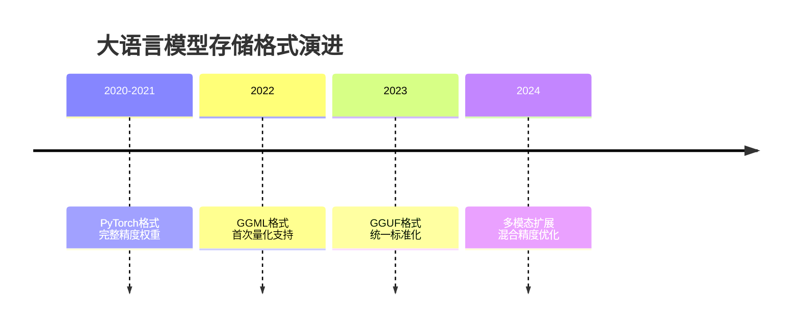
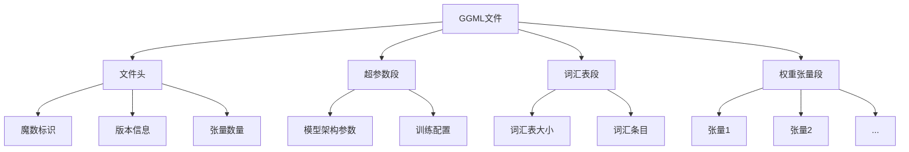
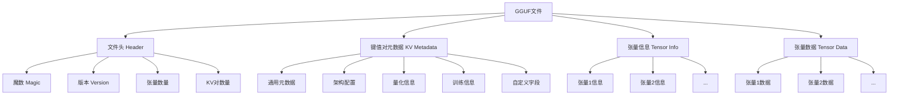

+++
date = '2025-02-28T22:19:54+08:00'
draft = false
title = '大语言模型存储格式发展历程'
tags = ["学习笔记","大语言模型", "GGML", "GGUF"]
featuredImage="/images/neuron_network.png"
+++


大语言模型存储格式的发展经历了从原始的完整精度存储到高效的量化存储的演进过程。GGUF格式作为当前的主流标准，通过统一的文件结构、丰富的元数据支持和灵活的量化选项，为大语言模型的广泛部署和应用提供了坚实的技术基础。这一发展不仅推动了模型在资源受限环境中的应用，也为未来的技术演进奠定了标准化框架。我们接下来一起看看LLM存储格式的发展过程。

## 概述




## 发展阶段

### 第一阶段：原始PyTorch格式（2020-2021）

#### 文件结构
使用`.pt`和`.pth`作为模型文件的扩展名，通过PyTorch框架进行模型训练时，使用Python的`pickle`模块进行序列化存储。


#### 实际文件内容示例

```python
# 使用torch.save保存的模型文件内容结构
{
    # 模型架构类名（用于加载时实例化）
    '__class__': 'TransformerModel',
    
    # 模型状态字典（核心权重）
    'state_dict': {
        'embedding.weight': tensor([[0.1, 0.2, ...], ...]),  # 嵌入层权重
        'transformer.layers.0.self_attn.q_proj.weight': tensor(...),
        'transformer.layers.0.self_attn.k_proj.weight': tensor(...),
        'transformer.layers.0.self_attn.v_proj.weight': tensor(...),
        'transformer.layers.0.self_attn.out_proj.weight': tensor(...),
        'transformer.layers.0.linear1.weight': tensor(...),
        'transformer.layers.0.linear2.weight': tensor(...),
        # ... 数十亿个参数
    },
    
    # 训练相关信息
    'training_config': {
        'vocab_size': 50257,
        'hidden_size': 768,
        'num_layers': 12,
        'num_heads': 12,
        # ... 其他配置
    },
    
    # 优化器状态（可选）
    'optimizer_state_dict': {...},
    
    # 训练进度
    'epoch': 100,
    'global_step': 50000
}
```


#### 实际使用示例

**1. 保存模型**
```python
import torch
import torch.nn as nn

# 定义简单模型
class SimpleModel(nn.Module):
    def __init__(self):
        super().__init__()
        self.linear = nn.Linear(1000, 500)
        self.activation = nn.ReLU()
    
    def forward(self, x):
        return self.activation(self.linear(x))

# 创建模型实例
model = SimpleModel()

# 方法1：只保存模型权重（推荐）
torch.save(model.state_dict(), 'model_weights.pth')

# 方法2：保存完整模型（包含架构）
torch.save(model, 'complete_model.pt')

# 方法3：保存检查点（训练过程中）
checkpoint = {
    'epoch': 10,
    'model_state_dict': model.state_dict(),
    'optimizer_state_dict': optimizer.state_dict(),
    'loss': 0.123,
    'config': {'hidden_size': 1000, 'output_size': 500}
}
torch.save(checkpoint, 'checkpoint.pth')
```

**2. 加载模型**
```python
# 方法1：加载权重到现有模型
model = SimpleModel()
model.load_state_dict(torch.load('model_weights.pth'))
model.eval()

# 方法2：直接加载完整模型
model = torch.load('complete_model.pt')
model.eval()

# 方法3：加载检查点
checkpoint = torch.load('checkpoint.pth')
model.load_state_dict(checkpoint['model_state_dict'])
optimizer.load_state_dict(checkpoint['optimizer_state_dict'])
epoch = checkpoint['epoch']
```


#### 文件格式特点

##### 优点
1. **简单易用**：Python原生支持，API简洁
2. **灵活性高**：支持任意Python对象序列化
3. **完整性好**：可以保存完整的训练状态
4. **兼容性强**：跨平台兼容性好

##### 缺点
1. **文件体积大**：存储完整精度权重，文件巨大
2. **加载速度慢**：pickle反序列化较慢
3. **安全性问题**：pickle存在安全风险
4. **部署困难**：需要Python环境和PyTorch库
5. **内存占用高**：推理时需要完整加载到内存


### 第二阶段：GGML格式（2022）
#### GGML文件格式架构


#### GGML文件格式逻辑结构

```c
// GGML文件头结构（C语言表示）
struct ggml_header {
    uint32_t magic;           // 魔数：0x67676d6c ("ggml")
    uint32_t version;         // 格式版本
    uint32_t n_tensors;       // 张量数量
    uint32_t n_kv;           // 键值对数量
    uint32_t flags;          // 标志位
};

// 张量元数据结构
struct ggml_tensor_info {
    char name[GGML_MAX_NAME]; // 张量名称
    uint32_t n_dims;         // 维度数量
    uint32_t ne[GGML_MAX_DIMS]; // 每个维度的大小
    uint32_t type;           // 数据类型和量化类型
    uint64_t offset;         // 在文件中的偏移量
};

// GGML量化类型枚举
enum ggml_type {
    GGML_TYPE_F32  = 0,      // 32位浮点
    GGML_TYPE_F16  = 1,      // 16位浮点
    GGML_TYPE_Q4_0 = 2,      // 4位量化，分组大小32
    GGML_TYPE_Q4_1 = 3,      // 4位量化，带缩放和偏置
    GGML_TYPE_Q5_0 = 6,      // 5位量化，分组大小32
    GGML_TYPE_Q5_1 = 7,      // 5位量化，带缩放和偏置
    GGML_TYPE_Q8_0 = 8,      // 8位量化，分组大小32
    GGML_TYPE_Q8_1 = 9,      // 8位量化，带缩放和偏置
    // ... 更多类型
};
```


#### GGML文件格式内容示例

**1. 模型配置文件部分**
```
# GGML模型配置示例
ggml_model
version: 1
n_tensors: 287
n_kv: 15

# 超参数
n_vocab: 32000
n_ctx: 2048
n_embd: 4096
n_head: 32
n_layer: 32
ftype: 2  # Q4_0量化

# 张量列表
tensor: token_embd.weight @ 0x1000
tensor: blk.0.attn_q.weight @ 0x2000
tensor: blk.0.attn_k.weight @ 0x3000
tensor: blk.0.attn_v.weight @ 0x4000
tensor: blk.0.attn_output.weight @ 0x5000
...
```

**2. 权重张量存储布局**
```
文件偏移布局：
0x0000: 文件头 (32字节)
0x0020: 超参数段 (256字节)
0x0120: 词汇表段 (变长)
0x1000: 张量数据开始

张量存储顺序：
1. token_embd.weight      [32000, 4096] Q4_0
2. blk.0.attn_q.weight    [4096, 4096] Q4_0  
3. blk.0.attn_k.weight    [4096, 4096] Q4_0
4. blk.0.attn_v.weight    [4096, 4096] Q4_0
5. blk.0.attn_output.weight [4096, 4096] Q4_0
6. blk.0.ffn_up.weight    [4096, 11008] Q4_0
7. blk.0.ffn_down.weight  [11008, 4096] Q4_0
...
```


#### GGML文件命名约定

典型的GGML文件命名为`模型名称-量化类型-[其他信息].bin`
示例：
```
llama-7b-q4_0.bin
llama-13b-q4_1.bin  
llama-30b-q5_0.bin
llama-65b-q8_0.bin
```

其中量化类型说明
- **q4_0**: 4位量化，基础版本
- **q4_1**: 4位量化，带偏置改进
- **q5_0**: 5位量化，平衡精度和压缩
- **q8_0**: 8位量化，接近原始精度

#### GGML文件格式特点

##### 优点
1. **量化技术**：可以显著减小模型体积，4位量化可将模型大小减少75-87%
2. **CPU友好**：支持在CPU上进行高效推理
3. **内存映射**：支持内存映射加载，减少内存占用
4. **硬件兼容**：支持x86、ARM等多种架构
5. **开源生态**：活跃的社区支持

##### 缺点
1. **格式不统一**：不同版本间兼容性问题
2. **元数据有限**：缺少丰富的模型配置信息
3. **扩展性差**：难以添加新特性
4. **量化精度损失**：低比特量化会损失模型性能
5. **工具链不完善**：缺少标准化的转换工具


### 第三阶段：GGUF格式（2023至今）
#### GGUF文件结构
整体架构如下：

文件格式定义为：
```c
// GGUF文件头结构（C语言表示）
struct gguf_header {
    uint32_t magic;           // 魔数：0x46554747 ("GGUF")
    uint32_t version;         // 格式版本（当前为3）
    uint64_t n_tensors;       // 张量数量
    uint64_t n_kv;           // 键值对数量
    uint64_t alignment;      // 内存对齐要求
    uint64_t data_offset;    // 数据段起始偏移
};

// 键值对条目结构
struct gguf_kv {
    uint64_t key_length;     // 键名长度
    char key[key_length];    // 键名字符串
    uint32_t value_type;     // 值类型
    union {
        uint8_t uint8;
        int8_t int8;
        uint16_t uint16;
        int16_t int16;
        uint32_t uint32;
        int32_t int32;
        float float32;
        uint64_t uint64;
        int64_t int64;
        double float64;
        bool boolean;
        char string[];       // 字符串数据
        uint8_t array[];     // 数组数据
    } value;
};

// 张量信息结构
struct gguf_tensor_info {
    uint64_t name_length;    // 张量名称长度
    char name[name_length];  // 张量名称
    uint32_t n_dims;         // 维度数量
    uint64_t shape[GGUF_MAX_DIMS]; // 每个维度大小
    uint32_t type;           // 数据类型
    uint64_t offset;         // 数据在文件中的偏移
};

```
#### GGUF文件格式示例
文件布局示例如下：
```
0x0000: GGUF文件头 (24字节)
0x0018: 键值对元数据段
    - general.architecture (字符串)
    - general.name (字符串) 
    - llama.context_length (uint32)
    - ... 更多KV对
0x1000: 张量信息数组
    - token_embd.weight信息
    - blk.0.attn_q.weight信息
    - ... 所有张量信息
0x2000: 张量数据段
    - token_embd.weight数据 (Q4_0量化)
    - blk.0.attn_q.weight数据 (Q4_0量化)
    - ... 所有张量数据
```
一个张量数据段示例如下：
```python
# GGUF张量存储优化示例
tensor_layout = {
    # 连续存储相关张量，提高缓存命中率
    'token_embd.weight': {
        'offset': 0x2000,
        'size': 32000 * 4096 // 2,  # Q4_0压缩后
        'type': GGUF_TYPE_Q4_0
    },
    
    # 注意力层权重连续存储
    'blk.0.attn_q.weight': {
        'offset': 0x2000 + 32000*4096//2,
        'size': 4096 * 4096 // 2,
        'type': GGUF_TYPE_Q4_0
    },
    'blk.0.attn_k.weight': {
        'offset': 0x2000 + (32000+4096)*4096//2,
        'size': 4096 * 4096 // 2,
        'type': GGUF_TYPE_Q4_0
    },
    # ... 以此类推
}
```

#### GGUF文件结构特点

**1. 统一文件结构**
```
GGUF文件结构：
├── 文件头
│   ├── 魔数标识
│   ├── 版本控制
│   └── 张量计数
├── 元数据段
│   ├── 模型架构
│   ├── 量化配置
│   ├── 训练信息
│   └── 自定义字段
└── 数据段
    ├── 权重张量
    └── 参数数据
```

**2. 增强的量化支持**
- 更精细的量化粒度
- 混合精度支持
- 动态量化配置

**3. 丰富的元数据**
- 完整的模型配置信息
- 训练超参数记录
- 硬件兼容性信息

**4. 生态工具链支持**
- **模型转换工具**: 支持多种源格式转换
- **量化工具**: 灵活的量化配置
- **验证工具**: 格式完整性和兼容性检查


#### GGUF与GGML的改进

| 特性 | GGML | GGUF | 改进说明 |
|------|------|------|----------|
| **文件结构** | 简单二进制 | 结构化分段 | 更好的可扩展性 |
| **元数据** | 有限配置 | 丰富KV对 | 完整模型信息 |
| **量化类型** | 基础量化 | 高级K-量化 | 更好的精度保持 |
| **版本控制** | 无明确版本 | 版本号管理 | 向前兼容性 |
| **工具支持** | 有限工具 | 完整工具链 | 更好的用户体验 |


## 未来发展趋势
1. **更高效的量化算法**
- 感知量化训练
- 动态精度调整
- 硬件感知优化

2. **多模态支持扩展**
- 视觉语言模型支持
- 音频模型集成
- 跨模态统一格式

3. **部署优化**
- 边缘设备优化
- 实时推理加速
- 分布式推理支持

4. **标准化进程**
- 行业标准制定
- 跨框架兼容性
- 安全性和验证机制

