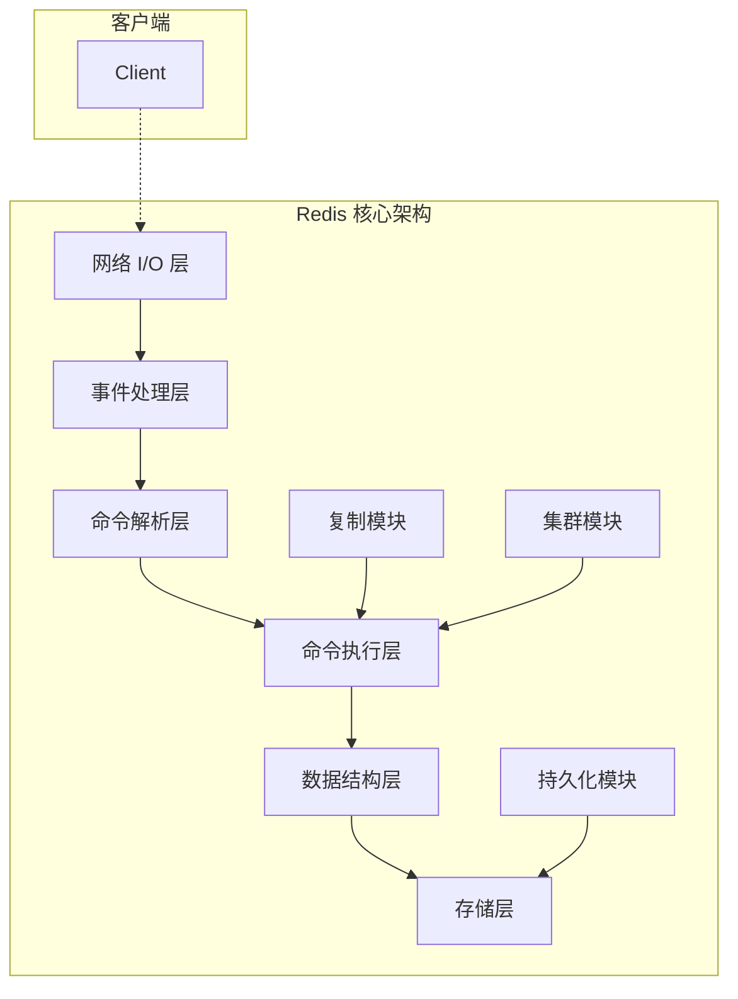
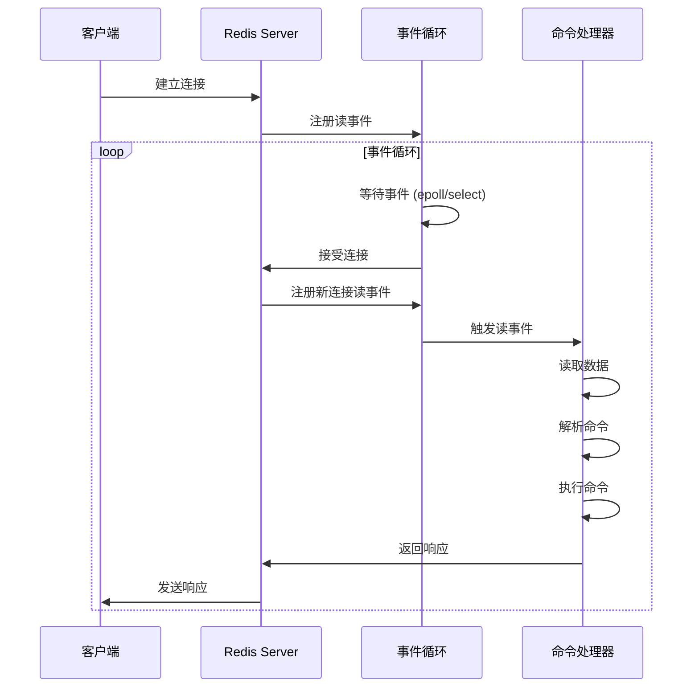
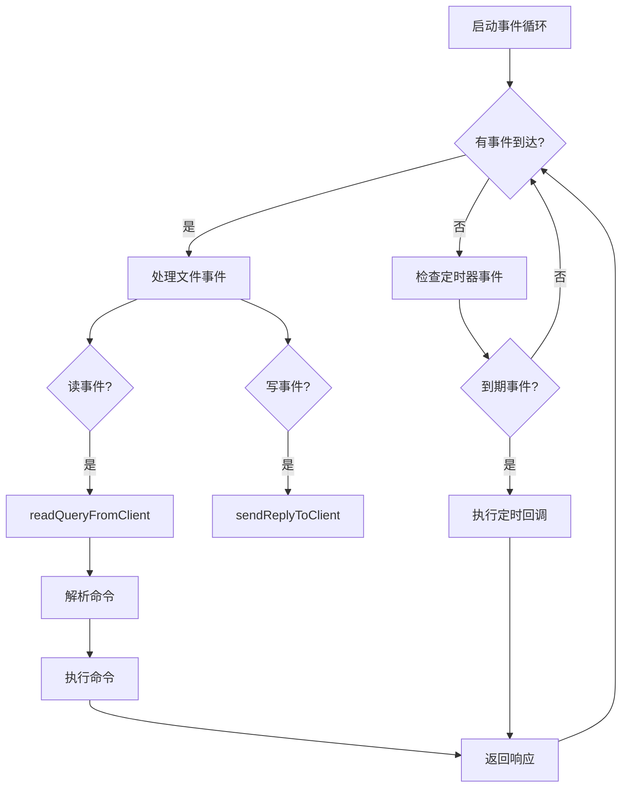
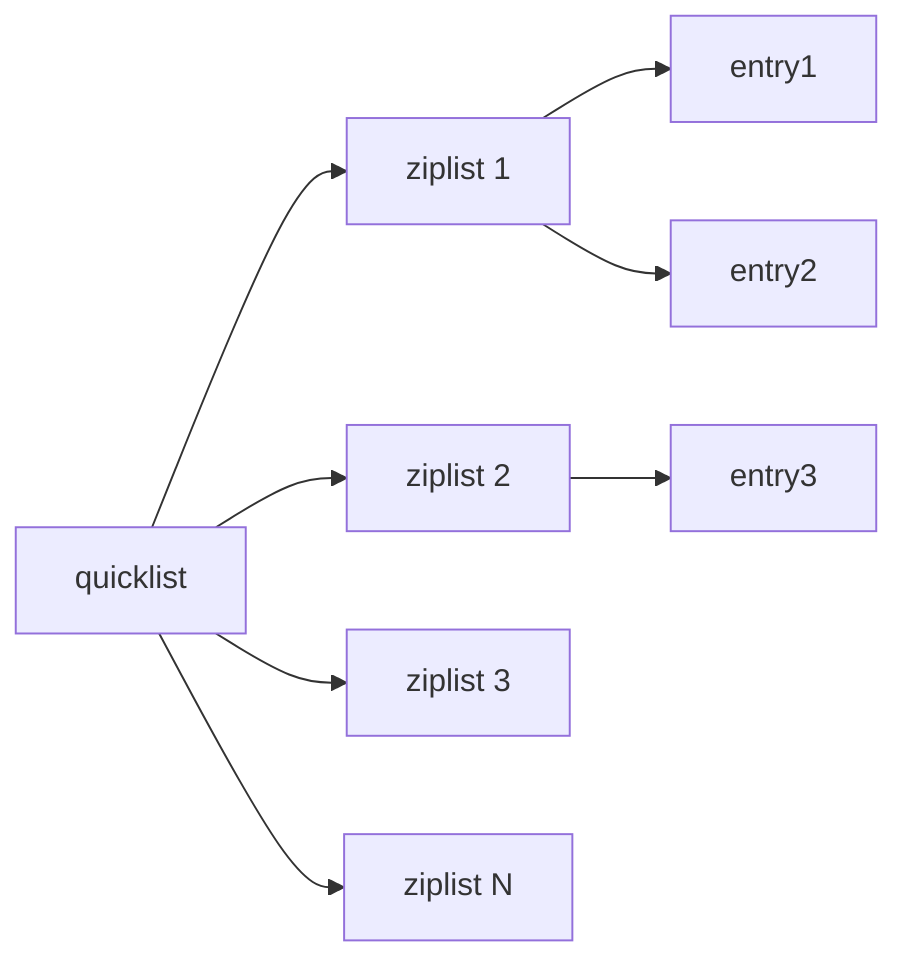
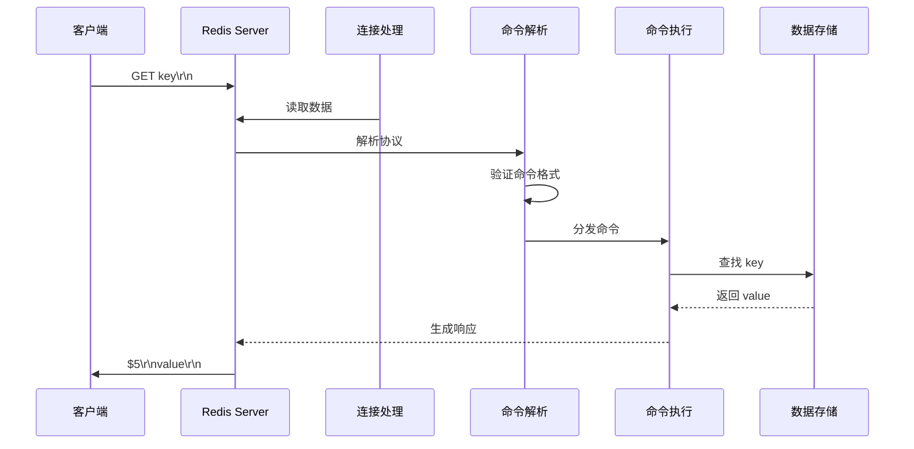
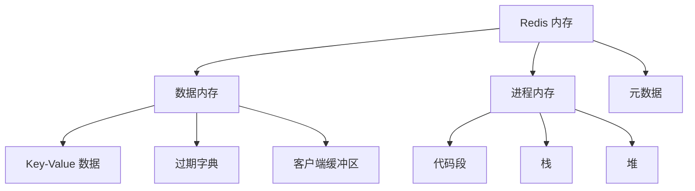
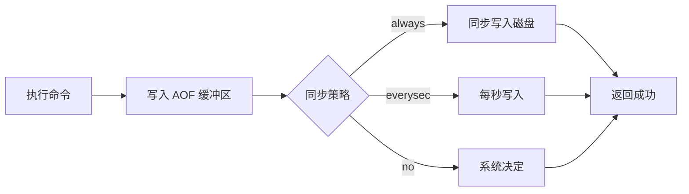
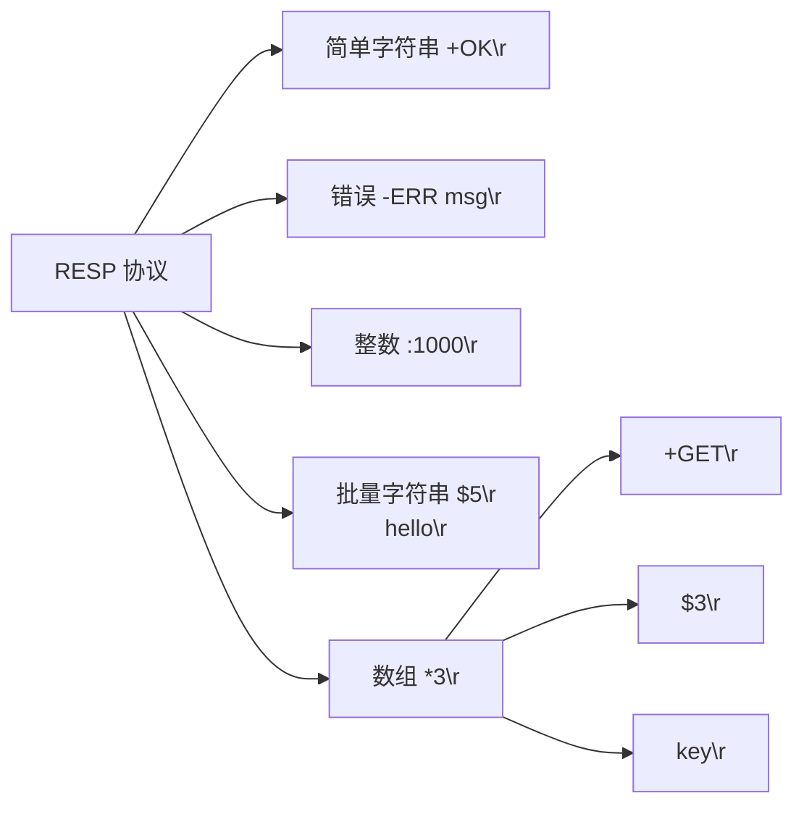
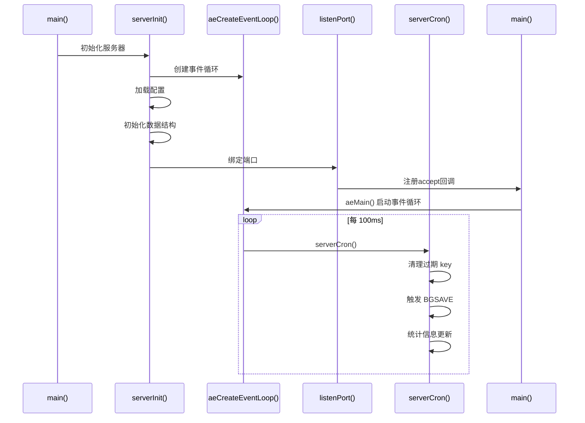
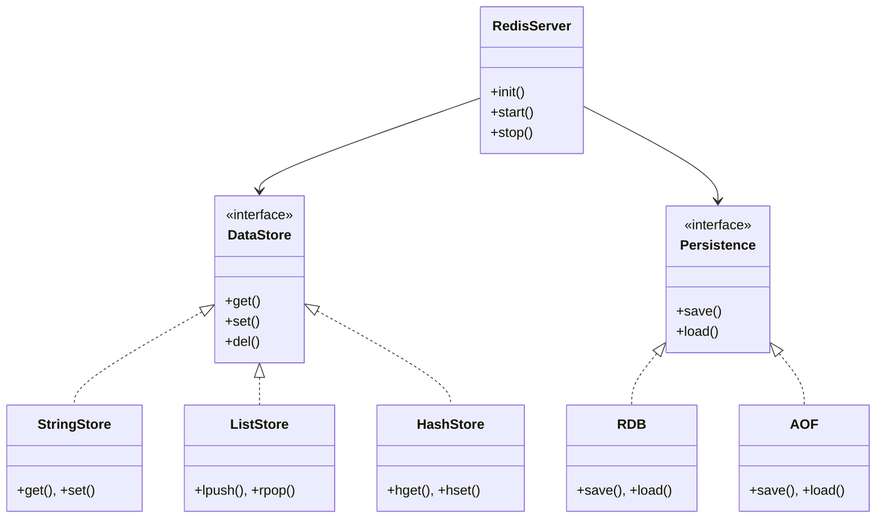

# Redis 核心架构深度解析：源码级别的技术指南

## 概述

Redis（Remote Dictionary Server）是一个开源的内存数据结构存储系统，被广泛应用于缓存、消息队列、分布式锁等场景。本文将从源码级别深入解析 Redis 的核心架构，探讨其高性能的设计秘诀。

## 核心架构概览

Redis 采用单进程单线程的 I/O 多路复用模型，通过事件循环处理客户端请求。整个系统可以划分为以下核心模块：



### 核心组件

| 组件 | 职责 |
|------|------|
| **网络 I/O 层** | 负责网络连接管理、TCP/UDP 处理 |
| **事件处理层** | I/O 事件、定时器事件的处理 |
| **命令解析层** | 协议解析、命令参数提取 |
| **命令执行层** | 命令分发、事务管理 |
| **数据结构层** | 内存数据结构的实现 |
| **存储层** | 持久化、复制相关功能 |

## 事件循环机制

Redis 使用 I/O 多路复用技术实现单进程单线程的高并发处理。这是 Redis 高性能的核心设计之一。

### Reactor 模式



### 核心数据结构

Redis 的事件循环核心数据结构如下：

```c
// ae.h - 事件循环结构
typedef struct aeEventLoop {
    int maxfd;              // 最大文件描述符
    int setsize;            // 最大连接数
    long long timeEventNextId;  // 定时器事件ID
    aeFileEvent *events;   // 文件事件数组
    aeFiredEvent *fired;   // 已触发事件数组
    aeTimeEvent *timeHead; // 定时器事件链表
    void *apidata;          // I/O 多路复用数据
    aeBeforeSleepProc *beforesleep;  // 休眠前回调
} aeEventLoop;
```

### 事件处理流程



## 数据结构层

Redis 并没有使用传统的字符串类型，而是自己实现了多种高性能数据结构。

### 简单动态字符串 (SDS)

Redis 的字符串实现不是 C 原生的 char*，而是自定义的 SDS（Simple Dynamic String）：

```c
// sds.h
struct sdshdr {
    int len;        // 已使用长度
    int free;       // 剩余长度
    char buf[];     // 柔性数组
};
```

**SDS vs C 字符串优势：**

| 特性 | C 字符串 | SDS |
|------|----------|-----|
| 获取长度 | O(n) | O(1) |
| 缓冲区溢出 | 可能 | 自动扩展 |
| 内存重分配 | 每次修改 | 预分配+惰性释放 |
| 二进制安全 | 否 | 是 |

### 字典 (Dict)

Redis 的字典采用哈希表实现，支持渐进式 rehash：

```c
// dict.h
typedef struct dict {
    dictType *type;      // 字典类型特定函数
    void *privdata;      // 私有数据
    dictht ht[2];        // 两个哈希表
    int rehashidx;       // rehash 进度 (-1 表示未进行)
    int iterators;       // 当前迭代器数量
} dict;
```

```mermaid
graph LR
    subgraph 哈希表结构
        A[dict] --> B[ht[0]]
        A --> C[ht[1]]
        B --> D[哈希桶数组]
        C --> E[迁移中的桶]
        D --> F[dictEntry 链表]
    end
```

### 压缩列表 (ziplist)

ziplist 是 Redis 专为小数据量设计的紧凑列表实现：

```c
// ziplist.c 结构
/*
 * | <zlbytes> | <zltail> | <zlend> | <entry1> | <entry2> | ... |
 *   4 bytes    4 bytes   1 byte    可变       可变
 */
```

**适用场景：**
- 少量元素
- 小值存储
- 列表、哈希、有序集合的底层实现

### 快速列表 (quicklist)

Redis 3.2+ 将 ziplist 组合为 quicklist，兼顾内存效率和遍历性能：



## 命令执行流程

### 整体流程



### 命令表与分发

```c
// server.c - 命令表结构
struct redisCommand redisCommandTable[] = {
    {"get", getCommand, 2, 0, NULL, 1, 1, 1},
    {"set", setCommand, -3, 0, NULL, 1, 1, 1},
    {"del", delCommand, -2, 0, NULL, 1, 1, 1},
    // ... 更多命令
};
```

### GET 命令执行示例

```c
// t_string.c
void getCommand(client *c) {
    getGenericCommand(c);
}

int getGenericCommand(client *c) {
    // 获取对象
    robj *o = lookupKeyRead(c->db, c->argv[1]);
    
    if (o == NULL) {
        // key 不存在
        addReplyNull(c);
        return C_OK;
    }
    
    // 检查类型
    if (o->type != OBJ_STRING) {
        addReplyError(c, "WRONGTYPE");
        return C_ERR;
    }
    
    // 返回值
    addReplyBulk(c, o);
    return C_OK;
}
```

## 内存管理

### 内存分配器

Redis 默认使用 jemalloc（高版本可选 tcmalloc），提供：

- 内存碎片率优化
- 缓存本地性
- 多线程支持

### 内存统计

```c
// server.h - 内存统计结构
typedef struct redisMemOverhead {
    size_t used;           // 已使用
    size_t peak;           // 峰值
    size_t fragmentation;  // 碎片率
    size_t lazyfree;       // 惰性释放等待中
} redisMemOverhead;
```



## 持久化机制

### RDB 快照

RDB 是定时生成的二进制快照：

```c
// rdb.c - 核心保存流程
int rdbSave(char *filename, rdbSaveInfo *rsi) {
    // 创建临时文件
    snprintf(tmpfile, 256, "temp-%d.rdb", pid);
    
    // 写入 RDB 头部
    rdbWriteRaw(rdb, RDB_MAGIC, strlen(RDB_MAGIC));
    
    // 遍历所有数据库
    for (j = 0; j < server.dbnum; j++) {
        redisDb *db = server.db+j;
        
        // 保存数据库数据
        if (rdbSaveDb(rdb, j) == C_ERR) goto werr;
    }
    
    // 写入尾部校验
    rdbWriteRaw(rdb, EOFMARK_SIZE, eof);
}
```

### AOF 持久化

AOF（Append Only File）记录所有写操作：



### 混合持久化 (4.0+)

Redis 4.0 引入了混合模式：

```
RDB格式 | AOF格式
--------|--------
二进制  | 文本命令
(头)    | (增量)
```

```c
// aof.c - 混合持久化
if (server.aof_use_rdb_preamble) {
    // 先写入 RDB
    rdbSaveRio(&aof->file, &rdbstate, 0);
    // 再追加 AOF
    aofRewriteAppendWriteRaw(buf, len);
}
```

## 网络通信协议

### RESP 协议

Redis 使用 RESP（Redis Serialization Protocol）：



### 客户端连接管理

```c
// networking.c - 客户端结构
typedef struct client {
    int fd;                     // 文件描述符
    robj *name;                 // 客户端名
    sds querybuf;               // 查询缓冲区
    int querybuf_peak;          // 缓冲区峰值
    list *reply;                // 响应链表
    redisDb *db;                // 当前数据库
    int flags;                  // 客户端标志
    char buf[PROTO_REPLY_CHUNK_BYTES];  // 固定缓冲区
    
    // 事务相关
    multiState mstate;          // 事务状态
    
    // 复制相关
    client *master;              // 主服务器
    list *pubsub_channels;      // 订阅频道
} client;
```

## 核心模块交互

### 启动流程



## 技术亮点总结

### 性能优化技巧

| 技术 | 作用 |
|------|------|
| **I/O 多路复用** | 单线程处理万级并发 |
| **内存数据结构** | O(1) 复杂度的数据结构 |
| **惰性删除** | 异步释放，避免阻塞 |
| **渐进式 rehash** | 分摊哈希表扩容成本 |
| **预分配** | 减少内存分配次数 |
| **Jemalloc** | 优化内存碎片 |

### 设计模式应用



## 总结

Redis 的核心设计体现了「简单高效」的原则：

1. **单线程模型** - 避免了锁竞争，轻松处理高并发
2. **内存数据结构** - 每种数据类型都有专用优化
3. **I/O 多路复用** - 高效管理大量连接
4. **渐进式设计** - 通过惰性删除、渐进式 rehash 避免性能抖动

这些设计选择让 Redis 成为最快的内存数据库之一，也是理解高性能系统设计的绝佳范本。

## 参考资源

- [Redis 官方文档](https://redis.io/documentation)
- [Redis 源码仓库](https://github.com/redis/redis)
- [《Redis设计与实现》](https://redisbook.com/)
