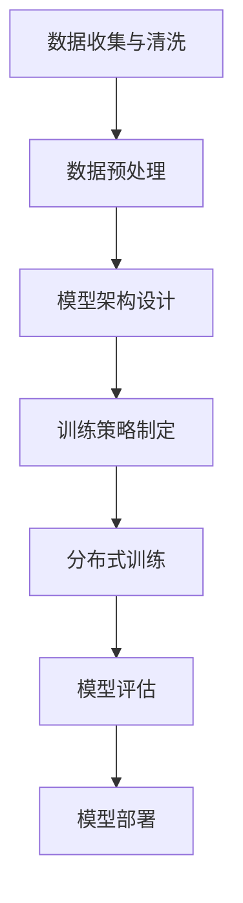

+++
date = '2026-02-17T22:17:48+08:00'
draft = false
title = '从0预训练大语言模型的完整指南'
tags = ["学习笔记","大语言模型", "预训练","Transformer", "分布式训练"]
featuredImage="neuron_network.png"
+++

## 概述
从0预训练大语言模型是一个系统工程，涉及数据准备、模型架构设计、训练策略、硬件配置等多个方面。整个过程通常需要数周到数月的时间，并需要大量的计算资源。

## 预训练流程概览



## 详细步骤

### 1. 数据准备阶段

#### 数据收集
- **数据源**：Common Crawl、维基百科、GitHub代码、学术论文、新闻文章等
- **数据量**：通常需要数TB到数十TB的文本数据
- **数据质量**：需要过滤低质量内容、重复数据、有害内容

#### 数据预处理
```python
# 数据清洗示例
from datasets import load_dataset
from transformers import AutoTokenizer

# 加载数据集
dataset = load_dataset("wikitext", "wikitext-2-raw-v1")

# 初始化分词器
tokenizer = AutoTokenizer.from_pretrained("distilbert/distilgpt2")
tokenizer.pad_token = tokenizer.eos_token

# 分词处理
def tokenize_function(examples):
    return tokenizer(examples["text"])

tokenized_dataset = dataset.map(tokenize_function, batched=True, num_proc=4)
```

### 2. 模型架构设计

#### 核心组件
- **Transformer架构**：多头自注意力机制
- **参数规模**：从几亿到数千亿参数
- **位置编码**：RoPE、ALiBi等
- **激活函数**：GELU、SwiGLU等

#### 模型配置示例
```python
from transformers import GPT2Config, GPT2LMHeadModel

config = GPT2Config(
    vocab_size=50257,
    n_positions=1024,
    n_embd=768,
    n_layer=12,
    n_head=12,
    n_inner=3072,
    activation_function="gelu_new",
    resid_pdrop=0.1,
    embd_pdrop=0.1,
    attn_pdrop=0.1,
    layer_norm_epsilon=1e-5,
)

model = GPT2LMHeadModel(config)
```

### 3. 训练策略

#### 预训练目标
- **因果语言建模**：预测下一个token
- **掩码语言建模**：预测被掩码的token

#### 训练配置
```python
from transformers import TrainingArguments, Trainer

training_args = TrainingArguments(
    output_dir="./results",
    per_device_train_batch_size=8,
    per_device_eval_batch_size=8,
    num_train_epochs=3,
    learning_rate=5e-5,
    warmup_steps=500,
    weight_decay=0.01,
    logging_dir="./logs",
    logging_steps=10,
    eval_steps=500,
    save_steps=1000,
    fp16=True,  # 混合精度训练
    dataloader_pin_memory=False,
)
```

### 4. 分布式训练

#### 硬件要求
- **GPU配置**：多张A100/H100 GPU
- **内存**：每张GPU 40-80GB显存
- **存储**：高速NVMe SSD用于数据加载

#### 分布式训练示例
```bash
# 使用Accelerate进行分布式训练
accelerate launch run_clm.py \
    --model_name_or_path openai-community/gpt2 \
    --dataset_name wikitext \
    --dataset_config_name wikitext-2-raw-v1 \
    --per_device_train_batch_size 8 \
    --per_device_eval_batch_size 8 \
    --do_train \
    --do_eval \
    --output_dir /tmp/test-clm \
    --fp16 \
    --gradient_accumulation_steps 4
```

### 5. 优化技术

#### 内存优化
```python
# 4位量化配置
from transformers import BitsAndBytesConfig

quantization_config = BitsAndBytesConfig(
    load_in_4bit=True,
    bnb_4bit_compute_dtype=torch.bfloat16,
    bnb_4bit_quant_type="nf4",
    bnb_4bit_use_double_quant=True,
)
```

#### 注意力优化
```python
# Flash Attention 2
model = AutoModelForCausalLM.from_pretrained(
    "Qwen/Qwen2-7B",
    attn_implementation="flash_attention_2"
)
```

### 6. 监控与评估

#### 训练监控
- **损失曲线**：监控训练和验证损失
- **困惑度**：评估模型性能
- **内存使用**：监控GPU内存使用情况

#### 评估指标
```python
from evaluate import load

perplexity = load("perplexity", module_type="metric")
results = perplexity.compute(
    predictions=generated_texts,
    model_id="gpt2"
)
```

### 7. 实际挑战与解决方案

#### 常见挑战
1. **计算资源**：需要大量GPU和存储
2. **数据质量**：数据清洗和去重是关键
3. **训练稳定性**：梯度裁剪、学习率调度
4. **内存限制**：梯度检查点、模型并行

#### 成本估算
- **小模型**：几万美元
- **中等模型**：数十万美元  
- **大模型**：数百万到数千万美元

### 8. 最佳实践

1. **渐进式训练**：从小规模开始，逐步扩大
2. **检查点保存**：定期保存模型状态
3. **实验跟踪**：使用W&B或MLflow跟踪实验
4. **安全考虑**：过滤有害内容，添加安全护栏

### 9. 工具和框架

- **Hugging Face Transformers**：模型实现和训练
- **Accelerate**：分布式训练
- **DeepSpeed**：优化训练效率
- **Weights & Biases**：实验跟踪

## 总结

从0预训练大语言模型是一个复杂但可行的过程。关键在于：
- 高质量的数据准备
- 合理的模型架构设计  
- 高效的训练策略
- 充分的硬件资源
- 持续的监控和优化

对于大多数团队，建议从现有预训练模型进行微调开始，积累经验后再考虑从0预训练。