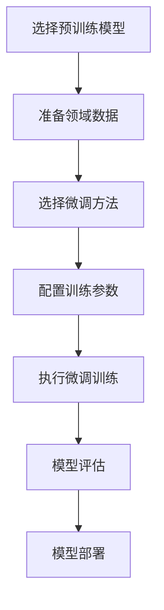

+++
date = '2025-02-27T22:19:54+08:00'
draft = false
title = '从现有预训练模型微调生产新大模型的完整指南'
tags = ["学习笔记","大语言模型", "微调", "LoRA", "PEFT"]
featuredImage="neuron_network.png"
+++

## 概述
微调是使用特定领域数据对预训练模型进行进一步训练的过程，可以显著提升模型在特定任务上的性能，同时大幅降低训练成本和时间。

## 微调流程概览



## 详细微调方法

### 1. 全参数微调

#### 基本流程
```python
from transformers import AutoModelForCausalLM, AutoTokenizer, TrainingArguments, Trainer

# 加载预训练模型和分词器
model_name = "meta-llama/Llama-2-7b-hf"
model = AutoModelForCausalLM.from_pretrained(model_name)
tokenizer = AutoTokenizer.from_pretrained(model_name)

# 配置训练参数
training_args = TrainingArguments(
    output_dir="./fine-tuned-model",
    per_device_train_batch_size=4,
    gradient_accumulation_steps=4,
    num_train_epochs=3,
    learning_rate=2e-5,
    fp16=True,
    logging_steps=10,
    save_steps=500,
    eval_steps=500,
    evaluation_strategy="steps",
)
```

### 2. 参数高效微调方法

#### LoRA (Low-Rank Adaptation)
```python
from peft import LoraConfig, get_peft_model

# LoRA配置
lora_config = LoraConfig(
    r=16,  # 秩
    lora_alpha=32,
    target_modules=["q_proj", "v_proj", "k_proj", "o_proj"],
    lora_dropout=0.1,
    bias="none",
    task_type="CAUSAL_LM"
)

# 应用LoRA
model = get_peft_model(model, lora_config)
model.print_trainable_parameters()  # 查看可训练参数
```

#### QLoRA (量化LoRA)
```python
from transformers import BitsAndBytesConfig
from peft import LoraConfig, get_peft_model

# 4位量化配置
bnb_config = BitsAndBytesConfig(
    load_in_4bit=True,
    bnb_4bit_use_double_quant=True,
    bnb_4bit_quant_type="nf4",
    bnb_4bit_compute_dtype=torch.bfloat16
)

# 加载量化模型
model = AutoModelForCausalLM.from_pretrained(
    model_name,
    quantization_config=bnb_config,
    device_map="auto"
)

# QLoRA配置
peft_config = LoraConfig(
    r=64,
    lora_alpha=16,
    target_modules=["q_proj", "k_proj", "v_proj", "o_proj"],
    lora_dropout=0.1,
    bias="none",
    task_type="CAUSAL_LM"
)

model = get_peft_model(model, peft_config)
```

### 3. 指令微调

#### 数据格式准备
```python
# 指令-响应格式数据
instruction_data = [
    {
        "instruction": "解释什么是机器学习",
        "input": "",
        "output": "机器学习是人工智能的一个分支..."
    },
    {
        "instruction": "将以下英文翻译成中文",
        "input": "Hello, how are you?",
        "output": "你好，你好吗？"
    }
]

# 转换为模型输入格式
def format_instruction(example):
    return f"### Instruction:\n{example['instruction']}\n\n### Input:\n{example['input']}\n\n### Response:\n{example['output']}"
```

#### 使用TRL进行指令微调
```python
from trl import SFTTrainer

trainer = SFTTrainer(
    model=model,
    train_dataset=dataset,
    dataset_text_field="text",
    max_seq_length=1024,
    tokenizer=tokenizer,
    args=training_args,
    packing=True,  # 打包序列以提高效率
)
```

### 4. 持续预训练

#### 领域自适应
```bash
# 使用因果语言建模进行持续预训练
python run_clm.py \
    --model_name_or_path meta-llama/Llama-2-7b-hf \
    --train_file domain_data.txt \
    --validation_file validation_data.txt \
    --per_device_train_batch_size 4 \
    --per_device_eval_batch_size 4 \
    --do_train \
    --do_eval \
    --output_dir ./domain-adapted-model \
    --learning_rate 1e-5 \
    --num_train_epochs 2 \
    --fp16
```

### 5. 多任务微调

#### 配置多任务训练
```python
from transformers import Trainer, TrainingArguments

# 合并多个数据集
multi_task_dataset = concatenate_datasets([dataset1, dataset2, dataset3])

training_args = TrainingArguments(
    output_dir="./multi-task-model",
    per_device_train_batch_size=4,
    num_train_epochs=5,
    learning_rate=3e-5,
    warmup_ratio=0.1,
    weight_decay=0.01,
    fp16=True,
    logging_steps=50,
    save_strategy="epoch",
)
```

## 数据准备策略

### 1. 数据收集与清洗
```python
from datasets import load_dataset, Dataset

# 加载公开数据集
dataset = load_dataset("dany0407/eli5_category", split="train[:1000]")

# 自定义数据处理
def preprocess_function(examples):
    # 数据清洗和格式化
    examples["text"] = [text.strip() for text in examples["text"]]
    return examples

processed_dataset = dataset.map(preprocess_function, batched=True)
```

### 2. 数据增强
```python
# 文本增强技术
def augment_text(text):
    # 同义词替换、回译、随机插入等
    augmented_texts = []
    # 实现数据增强逻辑
    return augmented_texts
```

## 训练优化技术

### 1. 学习率调度
```python
training_args = TrainingArguments(
    learning_rate=5e-5,
    lr_scheduler_type="cosine",  # 余弦退火
    warmup_steps=500,
)
```

### 2. 梯度累积
```python
training_args = TrainingArguments(
    per_device_train_batch_size=2,
    gradient_accumulation_steps=8,  # 等效batch_size=16
)
```

### 3. 混合精度训练
```python
training_args = TrainingArguments(
    fp16=True,  # 或 bf16=True
)
```

## 评估与监控

### 1. 评估指标
```python
from evaluate import load

# 困惑度评估
perplexity = load("perplexity")
results = perplexity.compute(
    model_id="gpt2",
    add_start_token=False,
    predictions=generated_texts
)

# 人工评估
def human_evaluation(generated_texts, reference_texts):
    # 实现人工评估逻辑
    pass
```

### 2. 训练监控
```python
# 使用Weights & Biases进行实验跟踪
import wandb

wandb.init(project="llm-finetuning")
training_args = TrainingArguments(
    report_to="wandb",
    logging_steps=10,
)
```

## 部署策略

### 1. 模型量化
```python
# 动态量化
from transformers import AutoModelForCausalLM
import torch

model = AutoModelForCausalLM.from_pretrained("./fine-tuned-model")
model_quantized = torch.quantization.quantize_dynamic(
    model, {torch.nn.Linear}, dtype=torch.qint8
)
```

### 2. 模型导出
```python
# 导出为ONNX格式
from transformers import AutoModelForCausalLM, AutoTokenizer
import torch

model = AutoModelForCausalLM.from_pretrained("./fine-tuned-model")
tokenizer = AutoTokenizer.from_pretrained("./fine-tuned-model")

dummy_input = tokenizer("Hello", return_tensors="pt")
torch.onnx.export(
    model,
    tuple(dummy_input.values()),
    "model.onnx",
    input_names=list(dummy_input.keys()),
    output_names=["logits"],
    dynamic_axes={
        'input_ids': {0: 'batch_size', 1: 'sequence_length'},
        'attention_mask': {0: 'batch_size', 1: 'sequence_length'},
    }
)
```

## 最佳实践

### 1. 数据策略
- **数据质量 > 数据数量**：精心筛选高质量数据
- **领域匹配**：确保微调数据与目标领域匹配
- **数据平衡**：避免数据偏差

### 2. 训练策略
- **渐进式微调**：从低学习率开始，逐步调整
- **早停机制**：防止过拟合
- **模型检查点**：定期保存中间结果

### 3. 资源优化
- **参数高效微调**：优先使用LoRA/QLoRA
- **梯度检查点**：节省内存
- **分布式训练**：充分利用多GPU

### 4. 成本控制
```python
# 成本估算函数
def estimate_cost(model_size, training_hours, gpu_type):
    gpu_hourly_cost = {
        "A100": 3.67,  # 美元/小时
        "V100": 2.48,
        "RTX4090": 0.8
    }
    return model_size * training_hours * gpu_hourly_cost[gpu_type]
```

## 常见微调场景

### 1. 代码生成模型
```python
# 使用代码数据进行微调
code_dataset = load_dataset("codeparrot/github-code", split="train[:10000]")
```

### 2. 医疗领域模型
```python
# 使用医学文献微调
medical_dataset = load_dataset("medical_corpus", split="train")
```

### 3. 法律文档模型
```python
# 使用法律文本微调
legal_dataset = load_dataset("legal_corpus", split="train")
```

## 总结

从现有预训练模型微调生产新大模型的关键要点：

1. **选择合适的基座模型**：根据任务需求选择合适规模的模型
2. **采用参数高效方法**：优先使用LoRA/QLoRA降低计算成本
3. **精心准备数据**：高质量、领域相关的数据是成功的关键
4. **合理配置训练参数**：学习率、batch size等超参数需要仔细调优
5. **持续监控和评估**：使用多种评估方法确保模型质量
6. **考虑部署需求**：提前规划模型部署和优化策略

通过合理的微调策略，可以在相对较低的成本下获得性能优异的领域专用大模型。